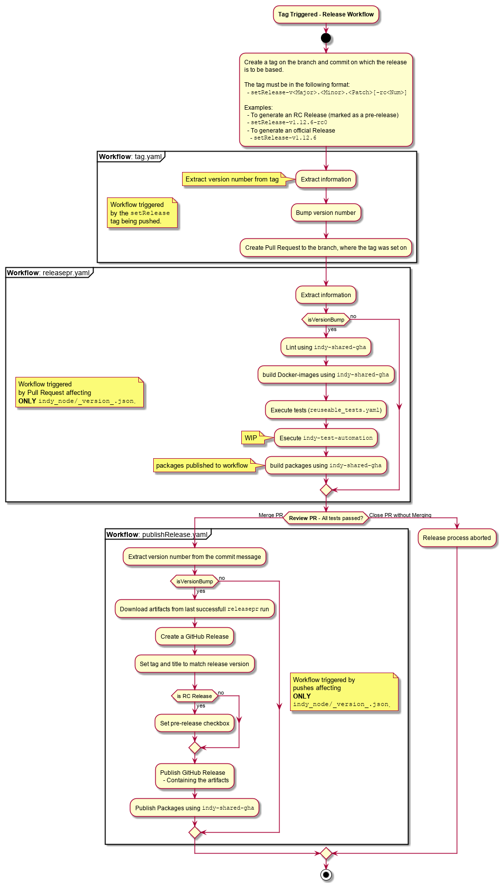

# Continuous Integration / Delivery

#### Branches

The `main` branch contains the current line of development supporting Ubuntu 20.04

#### Pull Requests

- Each PR needs to be reviewed.
- PR can be merged only after all tests pass and the code is reviewed.

## Continuous Integration

- for each PR we execute:
    - static code validation
    - Unit/Integration tests
- We use pipeline in code approach and Github Actions as our main CI/CD server.
- CI part of the pipeline (running tests for each PR) is defined in `.github/workflows/PR.yaml` file.
- CI part is run on Github, so they are public and open as every contributor needs to see results of the tests run for his or her PR.
   Github Actions are by default deactivated on new forks. The pipeline contain checks so that no publish action is tried on forks (which would likely fail due to missing login information).

#### Static Code Validation

- We use flake8 for static code validation.
- It's run against every PR. PR fails if there are some static code validation errors.
- Not all checks are enabled (have a look at `.flake8` file at the project root)
- You can run static code validation locally:
    - Install flake8: `pip install flake8`
    - Run validation on the root folder of the project: `flake8 .`

## Continuous Delivery

- CD part of the pipeline is defined in `.github/workflows/tag.yaml`, `.github/workflows/releasepr.yaml`, and `.github/workflows/publishRelease.yaml` file.
- CD part is run via GitHubActions issuing and uploading new builds.

#### Builds

What artifacts are produced after each push
- to `main` branch:
    - all artifacts include developmental release segment `devN` in their version, where `N` is a unix timestamp.
    - indy-plenum:
        - indy-plenum in [pypi](https://pypi.python.org/pypi/indy-plenum)
        - indy-plenum deb package in [`https://hyperledger.jfrog.io/artifactory/indy focal dev`](https://hyperledger.jfrog.io/ui/native/indy/pool/focal/dev/i/indy-plenum/)
    - indy-node:
        - indy-node in [pypi](https://pypi.python.org/pypi/indy-node)
        - indy-node deb package in [`https://hyperledger.jfrog.io/artifactory/indy focal dev`](https://hyperledger.jfrog.io/ui/native/indy/pool/focal/dev/i/indy-node/)

Use cases for artifacts
- PyPI artifacts can be used for development experiments, but not intended to be used for production.
- Using deb packages is recommended way to be used for a test/production pool on Ubuntu.
    - The deb packages from [`https://hyperledger.jfrog.io/artifactory/indy focal stable`](https://hyperledger.jfrog.io/ui/native/indy/pool/focal/stable/) are the only official stable releases that can be used for production (stable version).
    - The deb packages from [`https://hyperledger.jfrog.io/artifactory/indy focal dev`](https://hyperledger.jfrog.io/ui/native/indy/pool/focal/dev/) contain the latest changes (from `main` branch). They are not guaranteed to be stable.

#### Packaging

##### Supported platforms and OSes

- Ubuntu 20.04 on x86_64

##### Build scripts

We use [fpm](https://github.com/jordansissel/fpm) for packaging python code into deb packages. Build scripts are placed in `build-scripts` folders:
- https://github.com/hyperledger/indy-node/blob/main/build-scripts
- https://github.com/hyperledger/indy-plenum/blob/main/build-scripts

We also pack some 3rd parties dependencies which are not presented in canonical ubuntu repositories:
- https://github.com/hyperledger/indy-node/tree/main/build-scripts/ubuntu-2004/build-3rd-parties.sh
- https://github.com/hyperledger/indy-plenum/tree/main/build-scripts//ubuntu-2004/build-3rd-parties.sh

Each `build-scripts` folder includes `Readme.md`. Please check them for more details.

#### Versioning

- Please note, that we are using versioning that satisfies [PEP 440](https://www.python.org/dev/peps/pep-0440) with release segment as `MAJOR.MINOR.PATCH` that satisfies [SemVer](https://semver.org/) as well.
- Version is set in the code (see [\_\_version\_\_.json](https://github.com/hyperledger/indy-node/blob/main/indy_node/__version__.json)).
- Version is bumped for new releases / hotfixes either manually or using [bump_version.sh](https://github.com/hyperledger/indy-node/blob/main/indy_node/bump_version.sh) script. The latter is preferred.
- During development phase version includes developmental segment `devN`, where `N` is a unix timestamp at buildtime.
- During release preparation phase (release / hotfix workflows) version includes pre-release segment `rcN`, where `N>=1` and set in the source code by developers.
- Each dependency (including indy-plenum) has a strict version (see [setup.py](https://github.com/hyperledger/indy-node/blob/main/setup.py))
- If you install indy-node (either from pypi, or from deb package), the specified in setup.py version of indy-plenum is installed.

## Release workflow
It starts with setting a tag in the form of `setRelease-v<Major>.<Minor>.<Patch>[-rc<Num>]`.

### Feature Release

#### 1. Release Candidate and Release Preparation

1. [**Maintainer**]
    - Create `setRelease-vX.Y.Z` tag on desired branch (most of the time it would be `main`).
2. [**GHA `tag.yaml`**]
    - Bumps version
    - creates PR with the updated Version
2. [**GHA `releasepr.yaml`**]
    - Runs on the update Version PR
    - Tests the code (e.g. DCO, CI testing, static code validation etc.).
    - Builds packages.

#### 2. Release Candidate and Release Acceptance

**Note** If any of the following steps fails new release candidate should be prepared.

1. [**Maintainer**]
    - Wait till the PR with the updated Version number from the RC preperation step is created and the Pipeline has run its tests (`releasepr.yaml` run successfully).
2. [**Maintainer**]
    - If all checks passed and RC is approved merge the update version PR. It will kick of the `publishRelease.yaml` Pipeline, which creates a Github Release and publishes the packages.
    - Otherwise: just close the update version PR **without** merging.
3. [**GHA (`publishRelease.yaml`)**]
    - Gets the artifacts from the last successfull `releasepr.yaml` run.
    - Publishes the artifacts to a Github Release, pypi and Artifactory.

#### 4. New Development Cycle Start

### Hotfix Release

Hotfix release is quite similar except the following difference:
  - hotfix branches named `hotfix-X.Y.Z` created from last Release commit/tag;
  - `main` usually is not merged since hotfixes (as a rule) should include only fixes for released code.
  - `setRelease`-Tag created on Hotfix branch.